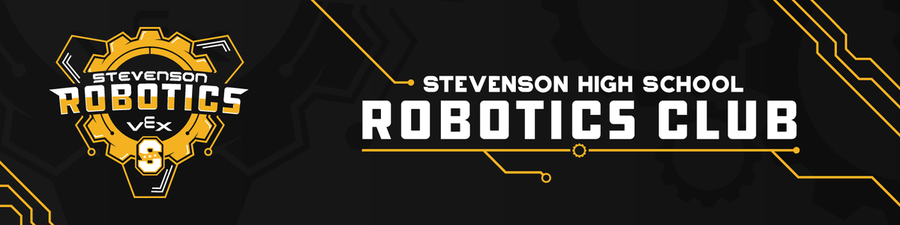
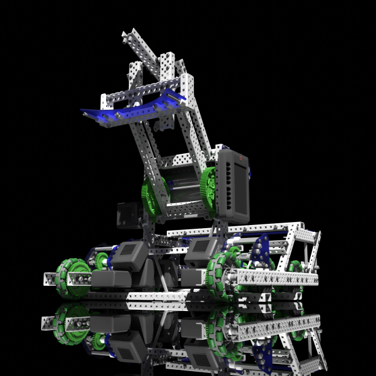

# **X - Drive**

Stevenson 1965Y 2021-2022

Competition styled for Vex EDR [Tipping Point](https://www.vexrobotics.com/vexedr/competition/vrc-current-game "VEX Current Game"). Coded with [VEXCode V5 Pro](https://www.vexrobotics.com/vexcode "VEXCode V5") in C++ using the [VEXcode API](https://api.vexcode.cloud/v5/).
Find this code [here](https://www.github.com/IyadHamid/StevensonVex1965Y-TippingPoint "Stevenson 1965Y Repository") on GitHub!

This repository/project also contains a regular log [here](Log.md).

## **The Team:**
- Adam Taylor
- Andrei Nistor
- Iyad Hamid - *Primary Coder*
- Joshua Neela
- Neil Thakker
- Tanmay Panchpor
	
## **Functionality**
- Generic PID controller
- Generic intelligent drivetrain
  - Uses PID controller for precise autonomous control
  - Has controller functions for driver control
- Simple 2D vector
  - A *lot* of vector mathmematics used
- Useful **comments** *everywhere*!
  - And a comprehensive [log](./log.md)!

## **Robot Configuration**
Configured in [config.h](./include/config.h).

| Name               | Type     | Port(s) |
|:-------------------|:---------|:--------|
|`front left drive  `| motor    | 13      |
|`back left drive   `| motor    | 16      |
|`top left drive    `| motor    | 17      |
|`front right drive `| motor    | 10      |
|`back right drive  `| motor    | 9       |
|`top right drive   `| motor    | 8       |
|`lifts             `| motor    | 5       |
|`intakes           `| motor    | 6       |
|`inertial sensor   `| sensor   | 2       |
|`front claw        `| solenoid | F       |
|`back claw         `| solenoid | H       |

## **Controller Configuration**
**TBA**

# *...because it "just works".*